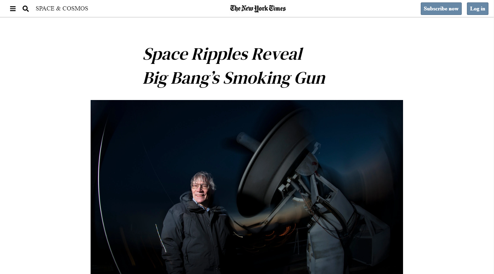

# Project Name

> Microverse Project - Positioning and Floating Elements
>The goal was to build a clone from a newspaper article.
>We cloned the article [Space Ripples Reveal Big Bang’s Smoking Gun](https://www.nytimes.com/2014/03/18/science/space/detection-of-waves-in-space-buttresses-landmark-theory-of-big-bang.html?_r=0)

You can find the original description in [The Odin Project](https://www.theodinproject.com/courses/html5-and-css3/lessons/positioning-and-floating-elements)

## Built With

- HTML, CSS3

## Live Demo

[Live Demo Link](https://rawcdn.githack.com/bruna-genz/newspaper-article/40285d6e3e2b0651370351f322a03a0906ec53f2/index.html)

## Getting Started

To get a local copy up and running follow these simple example steps.
- open a new terminal and run the next command:
- `git clone git@github.com:bruna-genz/newspaper-article.git`

### Prerequisites
- web browser

## Authors

👤 **Oscar De La Lanza**

- Github: [@oscardelalanza](https://github.com/oscardelalanza)
- Twitter: [@oscardelalanza](https://twitter.com/oscardelalanza)
- Linkedin: [Oscar De La Lanza](https://linkedin.com/in/oscardelalanza)

👤 **Bruna Genz**

- Github: [@bruna-genz](https://github.com/bruna-genz)
- Twitter: [@Bruna_GK](https://twitter.com/Bruna_GK)
- Linkedin: [Bruna Genz](https://www.linkedin.com/in/brunagenz/)

## 🤝 Contributing

Contributions, issues and feature requests are welcome!

## Show your support

Give a ⭐️ if you like this project!
